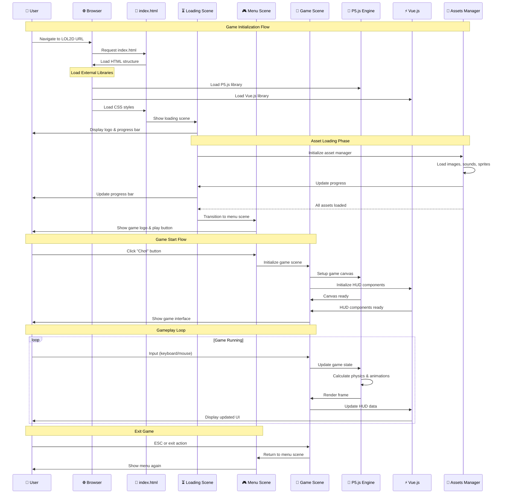
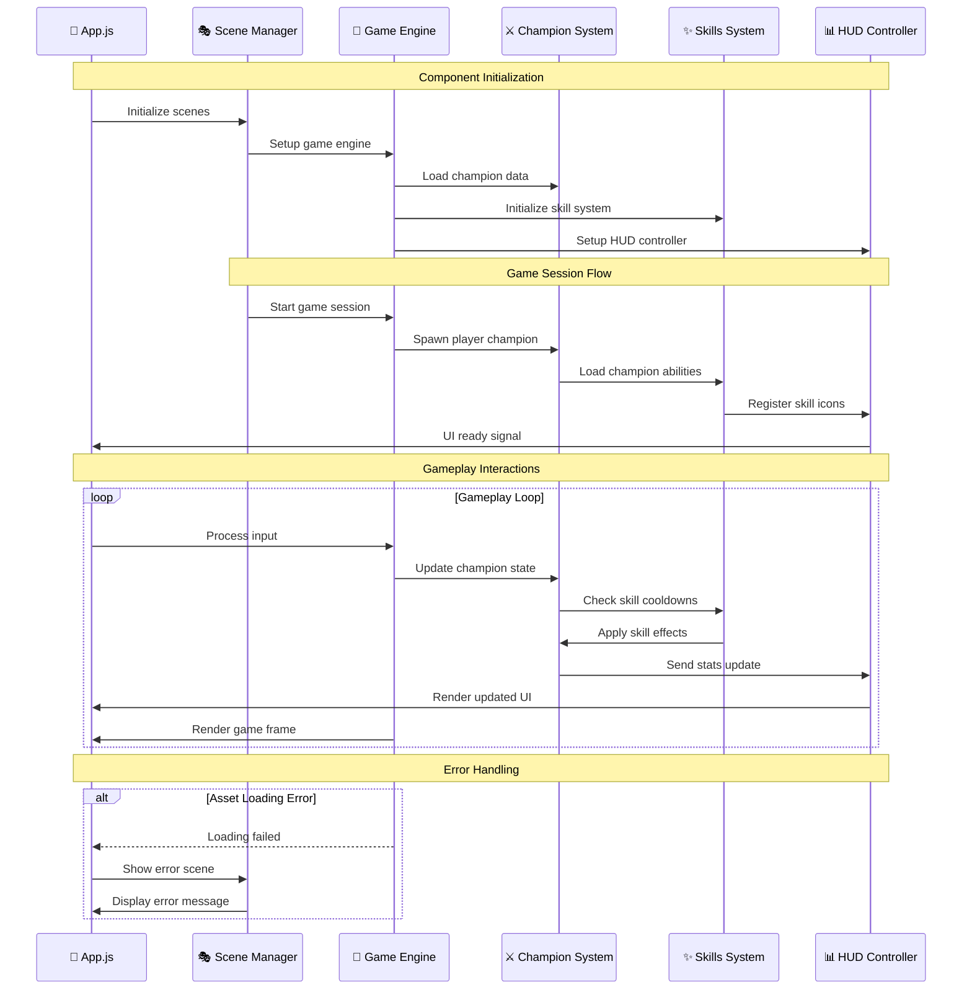
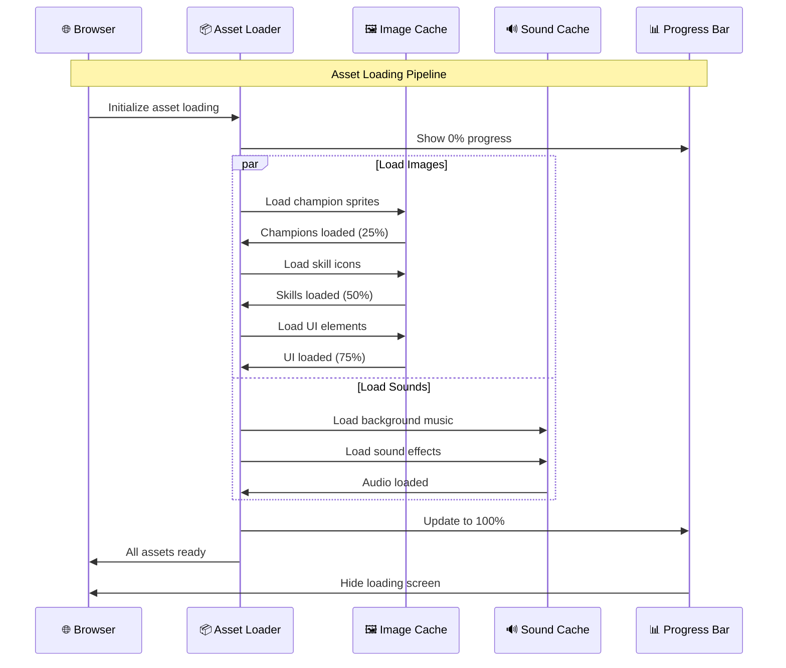

# LOL2D - Sequence Diagram

## Game Flow Sequence Diagram

```mermaid
sequenceDiagram
    participant User as 👤 User
    participant Browser as 🌐 Browser
    participant HTML as 📄 index.html
    participant Loading as ⏳ Loading Scene
    participant Menu as 🎮 Menu Scene
    participant Game as 🎯 Game Scene
    participant P5 as 🎨 P5.js Engine
    participant Vue as ⚡ Vue.js
    participant Assets as 📁 Assets Manager

    Note over User, Assets: Game Initialization Flow
    
    User->>Browser: Navigate to LOL2D URL
    Browser->>HTML: Request index.html
    HTML->>Browser: Load HTML structure
    
    Note over Browser: Load External Libraries
    Browser->>P5: Load P5.js library
    Browser->>Vue: Load Vue.js library
    Browser->>HTML: Load CSS styles
    
    HTML->>Loading: Show loading scene
    Loading->>User: Display logo & progress bar
    
    Note over Loading, Assets: Asset Loading Phase
    Loading->>Assets: Initialize asset manager
    Assets->>Assets: Load images, sounds, sprites
    Assets->>Loading: Update progress
    Loading->>User: Update progress bar
    
    Assets-->>Loading: All assets loaded
    Loading->>Menu: Transition to menu scene
    Menu->>User: Show game logo & play button
    
    Note over User, Game: Game Start Flow
    User->>Menu: Click "Chơi" button
    Menu->>Game: Initialize game scene
    Game->>P5: Setup game canvas
    Game->>Vue: Initialize HUD components
    
    P5->>Game: Canvas ready
    Vue->>Game: HUD components ready
    Game->>User: Show game interface
    
    Note over User, Game: Gameplay Loop
    loop Game Running
        User->>Game: Input (keyboard/mouse)
        Game->>P5: Update game state
        P5->>P5: Calculate physics & animations
        P5->>Game: Render frame
        Game->>Vue: Update HUD data
        Vue->>User: Display updated UI
    end
    
    Note over User, Menu: Exit Game
    User->>Game: ESC or exit action
    Game->>Menu: Return to menu scene
    Menu->>User: Show menu again
```

## Component Interaction Diagram

```mermaid
sequenceDiagram
    participant App as 📱 App.js
    participant SceneManager as 🎭 Scene Manager
    participant GameEngine as 🔧 Game Engine
    participant Champion as ⚔️ Champion System
    participant Skills as ✨ Skills System
    participant HUD as 📊 HUD Controller

    Note over App, HUD: Component Initialization
    
    App->>SceneManager: Initialize scenes
    SceneManager->>GameEngine: Setup game engine
    GameEngine->>Champion: Load champion data
    GameEngine->>Skills: Initialize skill system
    GameEngine->>HUD: Setup HUD controller
    
    Note over SceneManager, HUD: Game Session Flow
    
    SceneManager->>GameEngine: Start game session
    GameEngine->>Champion: Spawn player champion
    Champion->>Skills: Load champion abilities
    Skills->>HUD: Register skill icons
    HUD->>App: UI ready signal
    
    Note over App, HUD: Gameplay Interactions
    
    loop Gameplay Loop
        App->>GameEngine: Process input
        GameEngine->>Champion: Update champion state
        Champion->>Skills: Check skill cooldowns
        Skills->>Champion: Apply skill effects
        Champion->>HUD: Send stats update
        HUD->>App: Render updated UI
        GameEngine->>App: Render game frame
    end
    
    Note over App, HUD: Error Handling
    
    alt Asset Loading Error
        GameEngine-->>App: Loading failed
        App->>SceneManager: Show error scene
        SceneManager->>App: Display error message
    end
```

## Asset Loading Sequence

```mermaid
sequenceDiagram
    participant Browser as 🌐 Browser
    participant AssetLoader as 📦 Asset Loader
    participant ImageCache as 🖼️ Image Cache
    participant SoundCache as 🔊 Sound Cache
    participant ProgressBar as 📊 Progress Bar

    Note over Browser, ProgressBar: Asset Loading Pipeline
    
    Browser->>AssetLoader: Initialize asset loading
    AssetLoader->>ProgressBar: Show 0% progress
    
    par Load Images
        AssetLoader->>ImageCache: Load champion sprites
        ImageCache->>AssetLoader: Champions loaded (25%)
        AssetLoader->>ImageCache: Load skill icons
        ImageCache->>AssetLoader: Skills loaded (50%)
        AssetLoader->>ImageCache: Load UI elements
        ImageCache->>AssetLoader: UI loaded (75%)
    and Load Sounds
        AssetLoader->>SoundCache: Load background music
        AssetLoader->>SoundCache: Load sound effects
        SoundCache->>AssetLoader: Audio loaded
    end
    
    AssetLoader->>ProgressBar: Update to 100%
    AssetLoader->>Browser: All assets ready
    ProgressBar->>Browser: Hide loading screen
```